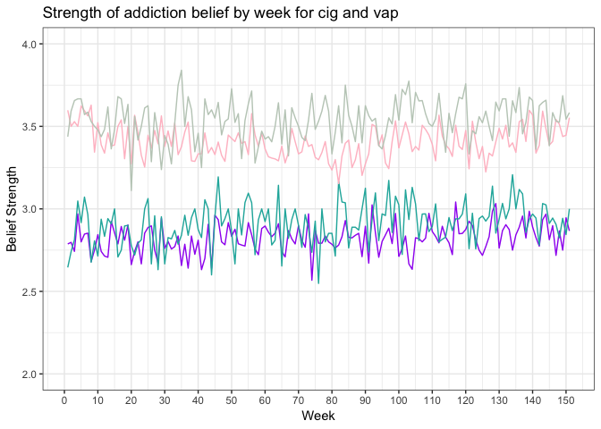
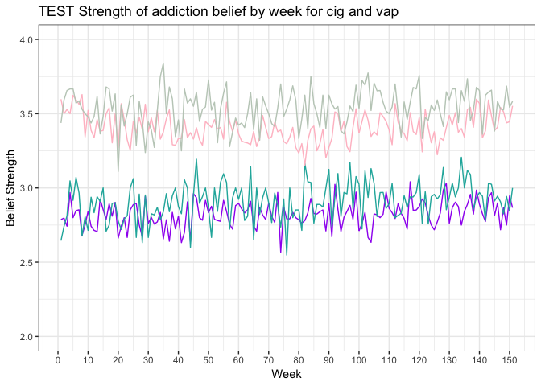

```r
library('ggplot2')
r <- read.csv('data/tcors_survey_data.csv')

# aggregate cig and vap addiction beliefs by week
r_vapingaddition1_wk <- aggregate(r$bel_vap_addict, list(week = r$week), mean, na.rm=T)
r_vapingaddiction2_wk <- aggregate(r$bel_vap_addict2, list(week = r$week), mean, na.rm=T)
r_cigaddiction1_wk <- aggregate(r$bel_cig_addict, list(week = r$week), mean, na.rm=T)
r_cigaddiction2_wk <- aggregate(r$bel_cig_addict2, list(week = r$week), mean, na.rm=T)

r_beltaste_wk <- aggregate(r$bel_vap_taste2, list(week = r$week), mean, na.rm=T)
r_beltaste_mo <- aggregate(r$bel_vap_taste2, list(month = r$month2), mean, na.rm=T)
```

This is an [R Markdown](http://rmarkdown.rstudio.com) Notebook. When you execute code within the notebook, the results appear beneath the code. 

Try executing this chunk by clicking the *Run* button within the chunk or by placing your cursor inside it and pressing *Cmd+Shift+Enter*. 


```r
# TEST plot cig and vap addiction beliefs by week
ggplot(r_beltaste_wk, aes(x = r_beltaste_wk$week, y = r_beltaste_wk$x)) +
  geom_line(y = r_vapingaddition1_wk$x, colour = "purple") + 
  geom_line(y = r_vapingaddiction2_wk$x, colour = "lightseagreen") +
  geom_line(y = r_cigaddiction1_wk$x, colour = "pink") +
  geom_line(y = r_cigaddiction2_wk$x, colour = "honeydew3") +
  xlab("Week") +
  ylab("Belief Strength") +
  scale_x_continuous(breaks=seq(0,150,10)) +
  scale_y_continuous(limits = c(2,4)) +
  ggtitle("Strength of addiction belief by week for cig and vap") +
  theme_bw()
```

<!-- -->


```r
# plot cig and vap addiction beliefs by week
ggplot(r_beltaste_wk, aes(x = week, y = x)) +
  geom_line(y = r_vapingaddition1_wk$x, colour = "purple") + 
  geom_line(y = r_vapingaddiction2_wk$x, colour = "lightseagreen") +
  geom_line(y = r_cigaddiction1_wk$x, colour = "pink") +
  geom_line(y = r_cigaddiction2_wk$x, colour = "honeydew3") +
  xlab("Week") +
  ylab("Belief Strength") +
  scale_x_continuous(breaks=seq(0,150,10)) +
  scale_y_continuous(limits = c(2,4)) +
  ggtitle("TEST Strength of addiction belief by week for cig and vap") +
  theme_bw()
```

<!-- -->


When you save the notebook, an HTML file containing the code and output will be saved alongside it (click the *Preview* button or press *Cmd+Shift+K* to preview the HTML file). 


The preview shows you a rendered HTML copy of the contents of the editor. Consequently, unlike *Knit*, *Preview* does not run any R code chunks. Instead, the output of the chunk when it was last run in the editor is displayed.


```r
# TEST plot cig and vap addiction beliefs by week
ggplot(r_beltaste_wk, aes(x = r_beltaste_wk$week, y = r_beltaste_wk$x)) +
  geom_line(y = r_vapingaddition1_wk$x, colour = "purple") + 
  geom_line(y = r_vapingaddiction2_wk$x, colour = "lightseagreen") +
  geom_line(y = r_cigaddiction1_wk$x, colour = "pink") +
  geom_line(y = r_cigaddiction2_wk$x, colour = "honeydew3") +
  xlab("Week") +
  ylab("Belief Strength") +
  scale_x_continuous(breaks=seq(0,150,10)) +
  scale_y_continuous(limits = c(2,4)) +
  ggtitle("Strength of addiction belief by week for cig and vap") +
  theme_bw()
```

<!-- -->
